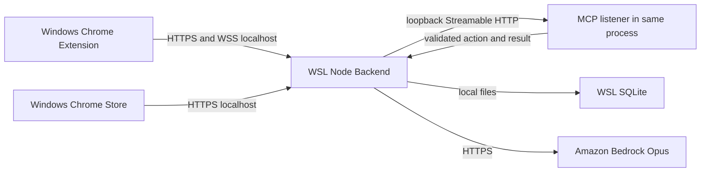

# U-01 — Local Demo Deployment Architecture

**상태**: 2026-09-09T01:37:45Z Infrastructure Design 사용자 승인 완료, 실행 전. 자원/설정은 [인프라 설계](infrastructure-design.md), 공유 소유·정리는 [공통 문서](../../shared-infrastructure.md)를 참조한다. 아래는 현재 WSL에서 구현할 제품의 실행 구조이며 실제 서비스 외부 경로 설정 계획이 아니다.

## 1. 실행 경로

대체 설명: Windows Chrome의 Extension과 Store가 localhost의 WSL Backend에 연결한다. 같은 Node 프로세스의 내부 MCP listener는 외부에 노출하지 않는다. MCP 실행은 Backend가 인증된 Extension 연결로 전달하고 요청자의 대상 탭에서 결과를 관찰해 돌려받는다. SQLite는 WSL 로컬 디스크, 모델은 외부 Bedrock이다. 그림의 요청 화살표는 응답/양방향 WSS를 생략한 것이며 MCP가 독립 브라우저를 실행한다는 뜻이 아니다.

## 2. 개발자 실행과 종료

아래 명령 이름은 Code Generation에서 만들 인터페이스 제안이며 지금 존재하거나 실행된 명령이 아니다. 일반 참여자는 개발자용 명령을 실행하지 않는다.

1. **준비**: 프로젝트에서 고정한 Node와 lockfile로 의존성을 준비한다. 비공개 모델 설정·로컬 TLS 파일·데이터 디렉터리를 검사한다. 데모 Actor 자격은 private 파일/설정으로 준비하고 로그나 공개 문서에 출력하지 않는다. 필요한 인증서 신뢰는 대상 브라우저에서 명시적으로 준비하며 기존 probe 재설치/재검증을 요구하지 않는다.
2. **빌드**: `npm run build`가 Backend·Store·Extension을 각각 산출한다. 제품 Extension은 이 빌드 결과를 개발자 모드로 사용한다. 원본 HTML 시안이나 임시 probe를 제품 성공 화면으로 배포하지 않는다.
3. **시작**: `npm run demo`가 Node 프로세스 하나를 시작한다. 설정 형식·DB schema/migration을 검사하고 내부 MCP와 HTTPS listener가 준비된 뒤 요청을 받는다. 모델 키 누락은 모델 경로의 설정 필요로 표시한다. TLS/DB 열기 실패나 포트 충돌에는 원인 분류를 반환하고 다른 실행 프로세스를 종료하거나 다른 DB로 바꾸지 않는다.
4. **사용**: Extension에서 현재 탭·Actor를 연결해 핵심 흐름을 수행한다. Store는 같은 origin의 별도 화면을 사용한다. 기록된 페이지 관찰·모델 결과·실제 브라우저 실행을 구분하며 사용자 흐름은 승인된 [기능 설계](../functional-design/business-logic-model.md)를 따른다.
5. **종료/교체**: Ctrl+C/SIGTERM을 받으면 새 접수·모델/브라우저 전달을 먼저 막고, 진행 사실/미확인 상태를 저장한 뒤 socket·MCP·DB를 닫는다. 종료 대기는 유한하게 두며 초과 시 마지막 지속 기록으로 복구한다. 프로그램 종료를 모든 Job의 사용자 취소·성공으로 기록하지 않는다. 새 빌드 실행도 같은 데이터 디렉터리를 사용한다.

Windows 절전·WSL 종료 중에는 데모 서버를 사용할 수 없다. 자동 OS 설정 변경·상시 운영 서비스 등록 없이 시연 동안 해당 환경을 실행 상태로 유지한다. 재시작은 [NFR P-03](../nfr-design/nfr-design-patterns.md#p-03--대상별-순서와-연결-복구)의 조회/재확인 경로이며 전달된 변경을 자동 재전송하지 않는다.

## 3. 구현 후 확인 순서

| 확인 | 확보할 증거 / 경계 |
|---|---|
| 설정·빌드·기동 | 고정 런타임/lockfile, 실제 세 빌드 결과, TLS/DB/포트 오류의 정제 안내. 상태 확인 요청은 Bedrock을 호출하지 않으며 키/주소/Job 식별자를 응답·로그에 쓰지 않음. |
| 로컬 연결 | 실제 제품의 Windows Chrome→WSL HTTPS/WSS 및 내부 MCP 검색/호출. 인증서 신뢰와 허용 Extension ID·Actor를 확인. 이 단계에서는 과거 Extension/MinIO 검증을 다시 실행하지 않음. |
| 저장·종료·재시작 | 개인 설정·자산/공유 버전·Job·취소 상태가 동일 DB에서 조회되고 과거 live binding은 권한으로 복원되지 않음. DB 복사/초기화 없이 재기동 확인. |
| 핵심 데모 | 생성 도구·기본/개인 Skill·다른 입력·본인 탭 사후 상태·취소/재접속·Store/개선은 기존 AC 검증 연결로 확인. 예전 고정 probe 성공을 새 제품의 성공으로 전용하지 않음. |
| 두 Actor와 증거 | 별개 Actor/브라우저 문맥의 소유·실행/설치 검증을 수행하고 실제 제품 화면을 루트 screenshots/ 또는 result/에 저장해 README에 연결. 원격 참여자 접속은 별도 보류 상태로 표시. |

실제 실행 명령·검증 코드는 다음 Code Generation 계획의 승인 후 작성한다. 현재 승인된 것은 설계 문서이며 제품 구현·실제 TLS 신뢰·실행 성공을 주장하지 않는다.
