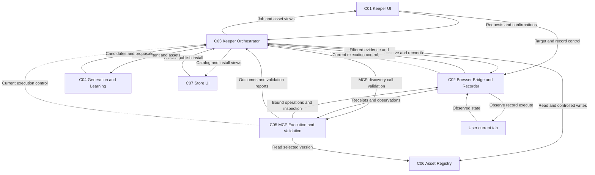

# Vibe Zoo — Component Dependencies

**상태**: 원문 재검토 후 승인된 Application Design. [책임](components.md), [계약](component-methods.md), [서비스](services.md)를 연결한다. 아래는 논리 호출·제어 관계이며 배포 토폴로지나 코드 import 구조가 아니다.

## 1. 의존성 행렬

행이 사용하는 쪽, 열이 제공하는 쪽이다. Q는 요청, R은 읽기, W는 변경, C는 현재 실행 제어 확인이다. 요청의 응답·진행 이벤트는 같은 계약의 역방향이므로 별도 업무 의존성으로 늘리지 않았다.

| 사용 → 제공 | C-01 | C-02 | C-03 | C-04 | C-05 | C-06 | C-07 |
|---|---|---|---|---|---|---|---|
| C-01 Keeper UI | — | Q: 대상/Record | Q: 준비/채팅/설정/확인 | — | — | — | — |
| C-02 Bridge/Recorder | — | — | C: 실행 유효성 | — | — | — | — |
| C-03 Orchestrator | — | Q: 관찰/결과 재확인 | — | Q: 생성/학습/개선 | Q: 검색/호출/검증 | R/W: 자산/설정/버전 | — |
| C-04 Generation/Learning | — | — | — | — | — | — | — |
| C-05 MCP Execution/Validation | — | Q: 실행/사후 관찰 | C: 실행 유효성/변경 확인 | — | — | R: 특정 버전 | — |
| C-06 Asset Registry | — | — | — | — | — | — | — |
| C-07 Store UI | — | — | Q: 탐색/게시/설치 | — | — | — | — |

C-04는 C-03이 제공한 근거·자산을 받아 후보와 추가 요청을 반환한다. C-03 호출에 대한 반환이므로 C-04가 Backend 상태를 다시 조정하는 의존성은 만들지 않는다. 모델 엔진·저장 드라이버 등 외부 기술 의존성은 후속 선택이다.

C-02/C-05의 C 표시는 C-03이 제공하는 ExecutionControl 인터페이스다. 요청과 제어 확인이 양방향인 것은 의도된 계약 관계이며 순환 import나 동기 네트워크 호출을 요구하지 않는다. 취소·재접속 중 최신 제어 상태를 확인하는 구체 방식은 해당 유닛 설계와 실제 Bridge 검증에서 정한다.

## 2. 통신과 데이터 소유 경계

| 경계 | 전달 내용·조정 방식 | 소유·보존 책임 |
|---|---|---|
| C-01 ↔ C-02 | 선택한 현재 탭, Record 시작/종료와 수집 범위·민감 입력을 제외한 기록 | C-02가 브라우저 생명주기와 기록 수집 경계를 확인한다. |
| Extension ↔ C-03/C-05 | 인증된 연결의 작업·대상·버전·변경 확인, 최소 관찰/시연, 지정 동작과 결과 | C-03은 대화/작업과 현재 연결 관계를 분리해 관리한다. C-02는 전송 전 민감 입력을 제외한다. |
| C-03 ↔ C-04 | 필요한 근거·명시적 의도·관련 자산 → 후보·추가 관찰/검증 제안 | C-03이 작업에 필요한 최소 개인 근거의 접근·저장 경계를 관리한다. C-04 출력은 검증 대상으로만 취급한다. |
| C-03/C-05 ↔ C-06 | 개인/공유 자산·고정 버전·설정·검증 근거 | C-06이 자산·버전·근거 연결을 보존하고 접근/반영 조건을 확인한다. 변경은 C-03이 조정한다. |
| C-07 ↔ C-03 | 공유 목록·선택 버전·게시/설치 상태 | 공개 가능한 자산 투영과 개인 원본 데이터를 분리한다. Store에서 사용자 브라우저 세션을 보관·제공하지 않는다. |

장기 작업은 접수와 후속 진행/결과를 구분하는 계약을 쓴다. 특정 HTTP 경로, WebSocket/SSE, MCP transport, 큐·DB 제품, 단일/다중 프로세스는 채택하지 않는다. 실제 MCP와 어댑터 실행이 이어져야 한다는 요구는 유지한다.

관찰/시연 원본과 개인 대화는 개인 작업 근거 영역이며 게시 자산 영역과 분리한다. 생성/공유 투영에서 인증정보와 민감 입력을 제외한다. 보존 기간·최소 수집 필드·삭제 트리거·모델 전송 범위의 구체 규칙은 NFR-02에 따라 후속 설계에서 정한다. 공개 저장소에는 NFR-08을 적용한다.

## 3. 핵심 데이터 흐름

텍스트 대안:

1. Keeper의 현재 탭 요청 또는 Store의 선택 버전 요청을 C-03이 받는다.
2. 준비된 자산은 C-06에서 읽는다. 생성/학습이 필요하면 C-02의 최소 근거와 의도를 C-04에 전달하고 후보를 C-06에 저장한다.
3. C-03은 C-05의 실제 MCP 검색·호출·검증을 조정한다. C-05는 고정 버전을 읽고 C-02를 통해 해당 사용자 탭에서 실행·사후 상태를 관찰한다.
4. C-02/C-05는 현재 실행 제어와 대상을 확인한다. C-03은 검증 결과와 현재 작업을 확인해 C-06에 반영하고 요청한 화면으로 상태·근거·다음 행동을 돌려준다.
5. Record 기반 개인화·공유 설치·개선도 위 실행·검증 경로를 재사용한다. 각 업무의 차이는 services.md에만 정의한다.

도표의 화살표는 논리 데이터 흐름이며 네트워크 연결 수를 뜻하지 않는다. C-05 상자만 그려 놓는 것으로 실제 MCP 연동을 증명할 수 없으며 해당 유닛 Code Generation과 Build and Test에서 확인한다.
