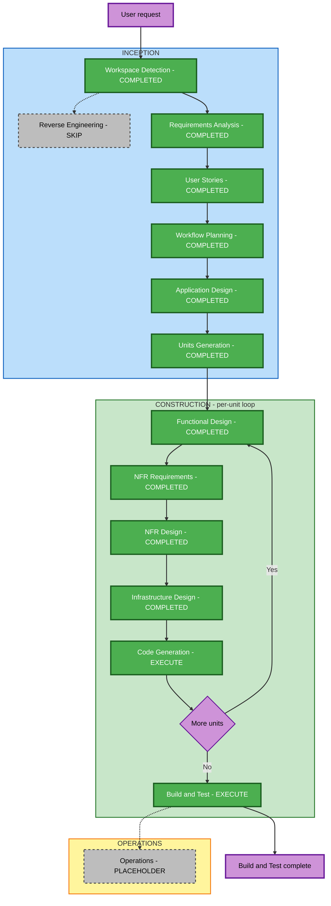

# Vibe Zoo — Execution Plan

## 1. 상태와 계획 원칙

- **상태**: Inception에 이어 2026-09-08T11:39:23Z U-01 Functional Design 네 산출물의 명시적 승인을 확인했다. NFR Requirements 두 산출물은 2026-09-09T01:15:35Z, NFR Design 두 산출물은 2026-09-09T01:27:56Z, 로컬 데모 Infrastructure Design은 2026-09-09T01:37:45Z 승인받아 Code Generation 계획 수립으로 진행한다.
- **승인 입력**: [requirements.md](../requirements/requirements.md), [확장 답변 B/B/C](../requirements/requirement-verification-questions.md), [stories.md](../user-stories/stories.md), [personas.md](../user-stories/personas.md).
- **범위**: Greenfield, 1박 2일·5명 해커톤. 확정 MVP와 FR/AC/NFR, US/CC 식별자를 참조하고 원문을 재작성하지 않는다.
- **추천**: 필요한 설계 단계를 간결하게 수행하고, 첫 구현 단위에서 현재 탭 관찰 → 생성 → 실제 MCP 호출 → 같은 사용자 탭 실행 → 다른 입력과 업무 결과 검증을 연결한다.
- **기술 상태**: 2026-09-09 사용자가 제품 기본 모델을 Amazon Bedrock / Claude Opus 4.8로 의도적으로 변경했다. 과거 Haiku 4.5 검증은 보존한다. TypeScript/Node.js·Converse 루프·공식 MCP·HTTPS/WSS·SQLite를 검증안으로 사용했고 기존 Chrome/MinIO의 제한된 읽기 왕복을 통과했다. 그 결과와 미검증 조건을 반영한 NFR 초기 기술 기준과 NFR Design의 논리 경계는 승인됐으며 Infrastructure Design에서 실제 자원에 배치한다. 후속 설계·코드 생성 계획의 승인은 별도다.
- **첫 데모 범위 — 2026-09-09 Q2**: 개발자 모드 Extension과 참여자용 팀 공용 Backend. 브라우저 실행은 요청자의 로그인 세션·대상 탭에서 수행한다. Chrome Web Store 배포는 MVP 제외, Vibe Zoo 자산 Store는 유지한다. 후속 사용자 지시로 개발 서버는 현재 WSL이며 실제 서비스 외부 접속 경로 설정은 보류한다. 로컬 환경을 확인했고 제품 연결은 구현 후 검증한다. 원격 참여자 접속 성공으로 확대하지 않는다. [NFR 계획 Q2](../../construction/plans/vibe-zoo-mvp-nfr-requirements-plan.md)를 참조한다.

## 2. 영향과 위험 분석

| 영향 영역 | 신규 작업과 경계 |
|---|---|
| 사용자 경험 | Keeper의 준비·채팅·Record·개인 설정, 별도 Store, 중단·복구 상태를 실제로 연결한다. |
| 구조 | Extension의 관찰·실행과 Backend의 생성·학습·Agent·MCP 연결, 자산·작업 관리 책임을 정한다. 논리 역할이 서버 개수를 뜻하지 않는다. |
| 데이터 | 도구·Skill·검증 근거·버전·개인 설정·대화·장기 작업·브라우저 연결의 관계와 수명을 설계한다. |
| 계약/API | 실제 MCP 검색·호출, 사용자/탭/문서에 묶인 관찰·실행과 진행·취소 계약이 필요하다. 전송의 초기 기준은 승인된 HTTPS/WSS와 내부 MCP이며 실제 배포 연결은 후속 확인 대상이다. |
| NFR | 기본 인증·실행 권한, 민감 입력 제외, 취소·재접속·버전 일관성, 탐색 예산과 채팅 동시성이 핵심이다. |
| 설치·운영 범위 | 데모에 필요한 설치·접속·환경 설정·영속 저장·간단한 로그/CI를 다룬다. 운영 보안 고도화·고가용성·재해복구는 포함하지 않는다. |

**위험도: High.** 새 시스템 전반과 실제 브라우저·생성 어댑터에 기술 불확실성이 있다. 운영 중인 중요 서비스 변경을 뜻하는 Critical로 분류하지 않는다. **되돌리기 복잡도: Moderate** — 코드·자산 버전은 복구 가능하게 설계하되 웹앱에서 발생한 변경을 취소가 되돌렸다고 가정하지 않는다. **검증 복잡도: Complex** — 실제 모델·MCP·Extension·웹앱 결과를 연결해야 하므로 핵심 전체 흐름을 일찍 확인한다.

| 주요 불확실성 | 가장 이른 확인 위치 | 관련 검증 |
|---|---|---|
| 생성 어댑터의 MV3·목표 배포 적합성 | 해당 유닛 NFR Requirements/Infrastructure Design에서 후보·제약 비교, 첫 Code Generation에서 실제 확인 | US-02·03; AC-02~04·10 |
| Backend/엔진·모델 접근과 다단계 실행 | 해당 유닛 NFR Requirements에서 선택 근거 정리, 첫 Code Generation에서 생성·호출·취소 경로 확인 | US-02·03·09; CC-04·08 |
| 잘못된 사용자·탭·문서 실행 | Application Design에서 계약 경계, Functional/NFR Design에서 상태 규칙, 첫 실행 검증에서 거절 경로 확인 | AC-09; CC-01·05·06 |
| 취소·늦은 결과·재접속·버전 변화 | 해당 유닛 상태 설계와 Code Generation 검증 | US-09; CC-04~06 |
| 개인 Skill 재사용·공유·개선의 검증 | 해당 기능 유닛에서 다른 입력·다른 사용자·실패 및 성공 사례 검증 | AC-04~08; US-04~08 |

Brownfield 전용 변환 분석, 기존 패키지 갱신 순서·마이그레이션·기존 컴포넌트 그래프는 **해당 없음**이다. 신규 책임·유닛 관계는 Application Design과 Units Generation에서 작성한다.

## 3. 단계 선택과 상세 수준

실행으로 선택한 단계는 v1.0.1의 **필수 산출물을 모두 생성하되 필요한 상세만 작성**한다. 단계를 생략하는 것과 문서 분량을 줄이는 것은 구분한다. 공통 결정은 먼저 작성한 산출물을 참조하고 유닛별 차이만 기록한다.

| 단계 | 판단 | 상세 수준과 이유 |
|---|---|---|
| Workspace Detection | COMPLETED | Greenfield와 원본/생성 문서 경계 확인 완료. 재수행하지 않는다. |
| Reverse Engineering | SKIP | 분석할 기존 제품 구현이 없다. |
| Requirements Analysis | COMPLETED | Comprehensive 분석·사용자 승인 완료. 원문/식별자를 참조한다. |
| User Stories | COMPLETED | 7개 여정·9개 스토리·1개 페르소나와 공통 조건 승인 완료. |
| Workflow Planning | COMPLETED | Standard. 단계 선택·위험·검증 순서에 대한 사용자 승인 완료. |
| Application Design | COMPLETED | Standard. 신규 책임·계약·의존성과 실행·자산·작업 경계 작성, 원문 재검토 및 사용자 승인 완료. |
| Units Generation | COMPLETED | Standard. U-01 / vibe-zoo-mvp 통합 유닛의 필수 3문서 생성·검토·사용자 승인 완료. 담당자·물리 배포는 정하지 않았다. |
| Functional Design | COMPLETED | U-01의 엔터티·업무 규칙·흐름·Frontend 네 산출물 생성·검토 및 사용자 승인 완료. |
| NFR Requirements | COMPLETED | U-01의 두 산출물과 초기 기술 기준 승인 완료. 제한된 실제 읽기 검증과 제품/공용 배포 미검증 범위를 구분했다. |
| NFR Design | COMPLETED | U-01의 공통 패턴·논리 컴포넌트 두 문서 검토 및 명시적 승인 완료. 제품 실행 완료를 뜻하지 않는다. |
| Infrastructure Design | COMPLETED | U-01 현재 WSL 데모 실행·HTTPS/WSS·SQLite와 공유 자원 문서 승인 완료. 외부 서비스 접속 경로는 사용자 지시로 보류한다. |
| Code Generation | EXECUTE | 항상 실행, 유닛별 계획 승인 후 코드·필요 테스트·실행 경로를 완성한다. |
| Build and Test | EXECUTE | 항상 실행, 전체 유닛 완료 후 핵심 통합 검증과 재현·제출 증거를 확인한다. |
| Operations | PLACEHOLDER | v1.0.1의 향후 확장 자리다. 배포·운영 완료 단계로 사용하지 않는다. |

계획 수립 당시 후속 실행 단계 유형은 8개였으며, Inception과 U-01의 네 설계 단계 승인 후 현재 남은 유형은 **Construction 2개**다. 통합 유닛 하나의 Code Generation은 Part 1 계획 승인 → Part 2 구현/검토 순서로 수행하고 전체 Build and Test로 이어진다. 검토 수정이나 기술 가정 변화에 따른 재검증 횟수를 보장하는 의미는 아니다.

위 Construction 조건부 설계 단계는 프로젝트에 필요하다. 개별 유닛에서 새 업무 규칙·NFR·인프라 변경이 없어 생략 조건을 충족하면 해당 단계 규칙에 따라 SKIP 이유와 참조할 기존 산출물을 유닛 계획·상태에 명시한다. 이를 전체 기능이나 필수 검증을 생략하는 근거로 삼지 않는다.

## 4. 실행 순서와 협업

1. **Application Design**: 현재 사용자 탭과 Backend 사이의 논리 계약, 자산/작업/대화 경계, 책임과 의존성을 정한다. 언어·서버 수·엔진·배포를 시안에서 확정하지 않는다.
2. **Units Generation**: 첫 실제 전체 흐름을 이른 완료 지점으로 배치하는 유닛과 의존 순서를 정한다. 7개 여정·9개 스토리·5명을 유닛 수로 환산하지 않는다. 최종 유닛 분해는 이 단계에서 검토·승인한다.
3. **각 유닛 완주**: 해당 유닛의 Functional Design → NFR Requirements → NFR Design → Infrastructure Design → Code Generation을 적용 여부에 따라 수행한다. 설계부터 코드·필요 검증까지 완료한 뒤 다음 유닛으로 이동한다.
4. **전체 Build and Test**: 모든 유닛 완료 후 실제 설치부터 핵심 업무·개인화·공유·개선까지 통합 확인하고 README와 실제 스크린샷을 맞춘다.

첫 관련 유닛의 NFR/Infrastructure 단계에서는 기술 후보의 근거·제약·미검증 가정을 구분한다. **실행 실험 코드는 그 유닛의 승인된 Code Generation 계획에 포함**하며 별도 비공식 “기술 스파이크” 단계를 신설하지 않는다. 실제 실행 증거 없이 적합성·성능·배포 호환성을 검증 완료로 기록하지 않는다. 실험 결과가 가정을 부정하면 영향받는 설계·계획을 갱신하고 필요한 승인을 받은 뒤 그 결정에 의존하는 후속 작업을 확대한다.

**사용자 지정 연결 확인 예외 — 2026-09-09**: 이번 명시 요청에 한해 NFR Requirements에서 제공된 Bedrock 설정의 일반 응답·합성 도구 호출 응답을 각각 최소 요청으로 확인한다. 저장소 밖의 임시 검증 프로세스만 사용하고 설정 값·키·응답 원문·런타임 식별자는 기록하지 않는다. 이는 제품 실험·구현, 실제 MCP/Extension 통합, 기술 조합·배포 선택 또는 후속 단계 승인이 아니다. 새 단계는 추가하지 않으며 기존 제품 Code Generation 승인 경계를 유지한다.

**사용자 지정 검증 범위 확대 — 2026-09-09 Q3**: 이후 명시 요청으로 위 제한 예외를 Opus 4.8 응답 확인과 추천 구성의 작은 통합 검증까지 확대했다. 저장소 밖 임시 코드로 실제 MCP tools/list·tools/call, HTTPS/WSS, SQLite 지속 상태를 확인하며 요청자의 로그인된 대상 탭 접근이 확보되면 브라우저 실행·사후 상태를 확인한다. 프로토콜 합성 클라이언트 결과와 실제 사용자 탭 결과를 구분하고 접근할 수 없는 대상/자원은 미검증으로 남긴다. 합성 MinIO의 최소 필터 관찰/시연 근거만 모델 전송을 허용한다. Haiku 결과는 보존하고 자동 fallback하지 않는다. 이 제한 검증은 전체 제품 Code Generation이나 이후 단계 승인이 아니다.

공통 사용자/탭 경계, 취소와 사후 상태 검증은 첫 실행 경로부터 적용한다. US-09가 마지막 스토리 묶음이라는 이유로 마지막 구현까지 미루지 않는다. 앞선 유닛에서 검증한 공통 계약·패턴은 후속 유닛이 참조하며, 바뀌면 영향받는 기존 성공 흐름도 재검증한다.

5명 협업은 확정된 현재 유닛 안에서 독립적인 구현·검토·검증 작업을 나눌 수 있다. 각 유닛의 상세 설계·구현을 동시에 시작하는 계획으로 해석하지 않는다. 개인 담당자나 기존 프로젝트 작업 분담을 복사하지 않는다.

## 5. 완료 지점과 일정 제약

아래는 유닛 이름이나 새로운 단계가 아니라 구현 진행 중 확인할 증거다. 세부 조건은 승인된 스토리와 CC를 참조한다.

| 완료 지점 | 확인할 결과 | 추적 |
|---|---|---|
| 첫 실제 전체 흐름 | Preset 없는 MinIO Console에서 관찰·생성·실제 MCP 호출·현재 사용자 탭 실행·사후 상태와 다른 입력 확인. 다른 미등록 사이트도 동일 요청 경로와 지원 범위를 표시 | US-01~03·09; AC-01~04·09·10 |
| 개인화 | Record + 의도, 기존 도구 조합/누락 도구 처리, 다른 입력 검증, 개인 설정의 저장·재사용 | US-04·05; AC-04~06 |
| 확장 시연 | 서로 다른 사용자의 특정 버전 공유·설치·자기 세션 검증, 재현 실패의 개선·회귀 검증·이전 버전 보존 | US-06~08; AC-07·08 |
| 최종 재현·제출 | 전체 AC-01~10과 관련 CC/NFR, 설치·실행 명령·기본 오류 처리·간단한 CI, README와 일치하는 실제 화면 증거 | requirements.md 5~6절; NFR-07·08 |

**기간 목표는 입력의 1박 2일**이다. 통합 유닛 U-01과 제한된 실제 읽기 연결 검증 결과가 확보됐지만 제품 생성·학습·공유 흐름은 구현 전이므로 단계별 시간을 수치로 보장하지 않는다. 초반에 실제 실행 경로를 확인하고 개인화·확장 시연·최종 재현으로 이어가도록 배치한다. 일정이 부족하면 임의로 AC-07·08을 삭제하지 않고 변경 근거와 영향이 있는 구체안을 제시해 사용자 결정을 받는다.

## 6. 워크플로우 시각화

색상은 완료/항상 실행(초록), 조건부 실행 선택(주황), 생략/자리표시자(회색)를 나타낸다. WP는 문서와 사용자 승인이 완료됐다. Construction의 설계 노드는 프로젝트에서 EXECUTE로 선택했으며 개별 유닛 생략은 3절의 조건을 따른다.

텍스트 대안:

- Inception: Workspace Detection 완료 → Reverse Engineering 생략 → Requirements Analysis 승인 완료 → User Stories 승인 완료 → Workflow Planning 승인 완료 → Application Design 승인 완료 → Units Generation 승인 완료.
- Construction: 각 유닛에서 적용되는 설계 단계 네 개와 Code Generation을 완료 → 다음 유닛 반복 → 모든 유닛 완료 후 Build and Test.
- Operations: PLACEHOLDER. 실제 데모의 설치·실행·배포 설정 검증은 Construction에서 다룬다.

## 7. 실행 체크리스트

- [x] 기존 상태·감사 기록·승인 요구사항·확장 답변·스토리·페르소나를 읽는다.
- [x] Greenfield 영향·위험을 분석하고 Brownfield 전용 분석을 해당 없음으로 구분한다.
- [x] 단계별 EXECUTE/SKIP/PLACEHOLDER와 적응적 상세 수준을 정한다.
- [x] 유닛별 완주·핵심 실행 검증·협업·일정 및 성공 기준을 계획한다.
- [x] Mermaid의 제한 문법·ID·참조·그룹과 유닛 반복 경로를 작성 전 검증하고 텍스트 대안을 포함한다.
- [x] 문서와 계획 일관성을 검토하고 상태·감사 기록 및 승인 질문을 갱신한다.
- [x] 사용자 실행 계획 승인을 기록한다 — 2026-09-08T09:33:58Z.

승인 후 후속 단계 추적:

- [x] Application Design — COMPLETED, 원문 재검토와 조건부 승인 확인
- [x] Units Generation — COMPLETED, 생성 산출물 승인 확인
- [x] 유닛별 Functional Design — U-01 네 산출물 생성·검토 및 사용자 승인 완료
- [x] 유닛별 NFR Requirements — U-01 COMPLETE, 두 산출물 명시적 승인 2026-09-09T01:15:35Z
- [x] 유닛별 NFR Design — U-01 두 산출물 명시적 승인, 2026-09-09T01:27:56Z
- [x] 유닛별 Infrastructure Design — U-01 현재 WSL 데모 산출물 명시적 승인, 2026-09-09T01:37:45Z
- [ ] 유닛별 Code Generation — U-01 16단계 Part 1 계획 작성·검토 완료, 계획 승인 대기; Part 2 미시작
- [ ] 전체 Build and Test — EXECUTE

각 단계의 필수 산출물은 해당 규칙을 실행 시 읽어 생성한다. 기존 요구사항·스토리·공통 조건을 참조하며 추가 요약 문서·중복 매핑은 만들지 않는다. 애플리케이션 코드·테스트는 저장소 제품 구조에, AI-DLC 문서는 aidlc-docs/에 둔다.

## 8. 확장 준수와 승인

Security Baseline, Resiliency Baseline, Property-Based Testing은 모두 **Enabled No / N/A**다. 해당 전문을 읽거나 적용하지 않았으며 기본 인증·권한·입력 검증·실행 경계·데이터 보호·핵심 테스트는 유지한다. 운영 고가용성·재해복구·보안 고도화·별도 부하 시험을 다시 필수화하지 않는다.

현재 계획 질문은 다음 하나다. 사용자는 대화로 답변하고 에이전트가 기록한다. 단계 포함·제외나 상세 수준은 사용자가 변경 요청할 수 있으며, 제품 요구사항에 영향을 주는 경우 그 영향을 함께 설명한다.

### Question 1 — 실행 계획 승인

이 실행 계획을 승인하고 Application Design으로 진행할까요?

**추천: A.** 논리 책임과 계약을 먼저 정리한 뒤 첫 구현 단위에서 실제 실행 경로를 검증하면 기술 불확실성을 일찍 확인할 수 있다. 필수 설계는 간결하게 유지하고 운영 범위는 추가하지 않는다.

A) 승인 — 위 실행 계획을 승인하고 Application Design을 시작한다.

B) 변경 요청 — 포함/생략할 단계, 상세 수준 또는 검증 순서의 변경을 설명한다.

X) 기타 — 원하는 진행 방식과 범위를 설명한다.

[Answer]: A — 2026-09-08T09:33:58Z 대화 답변 “응 진행해.”를 실행 계획 승인과 Application Design 진행 지시로 확인했다. 원문은 감사 기록에 보존했다.

승인 근거: [.aidlc-rule-details/inception/workflow-planning.md Step 9~10](../../../.aidlc-rule-details/inception/workflow-planning.md) 및 CLAUDE.md의 Workflow Planning 명시적 승인 gate를 통과했다. Application Design을 시작하며 후속 산출물 승인은 해당 단계에서 별도로 받는다.
